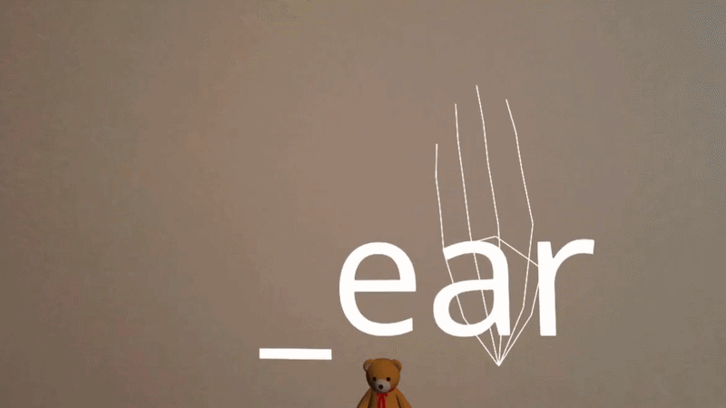

# Unspoken by Team Signcraft

A mixed-reality WebXR application to learn American Sign Language (ASL) with just your virtual reality headset and a web browser!

Built in 3 days at the first Meta & AWS WebXR Hackathon, hosted at Amazon's Seattle office (November 14–16, 2023). [Watch the event recap](https://www.youtube.com/watch?v=_oH8yu3IwOE).



## Presentation

👀 [View our project presentation (Google Slides)](https://docs.google.com/presentation/d/1EdOeE23vZ3Tpe50IoP7oSc8NIVPC7ECsIIR13EO8vcY/edit?usp=sharing)

## Hackathon Recap

🎥 [Watch the hackathon on YouTube](https://www.youtube.com/watch?v=_oH8yu3IwOE)

## Access Application

Try out our in-progress demo at [ringokam.github.io/unspoken/](ringokam.github.io/unspoken/)

## Project Breakdown

- `/docs` — Assets and Imported Libraries
- `/web` — Three.js Application

## Deploying Locally

To run the app locally:

```bash
npm i
npm run build
npm run serve
```

You will now be able to access the application at `https://localhost:8081/`

## Next Steps

We're planning to deploy the application to the cloud for broader, headset-free access.

## Team / Contributors

This project was developed as a team project in collaboration with:

- Boe – WebXR Developer
- Oscar – Cloud Architect
- Ringo – WebXR Developer
- Shmoji – WebXR Developer
- Yifan Lin – UX Designer

Original repository: https://github.com/RingoKam/unspoken

This repo is a mirrored copy preserving the full commit history for personal portfolio purposes.
